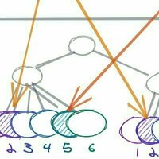

# 🍄 GADA

## ⌛ 프로젝트 진행 기간

- 2024.01.02 ~

## 🎞️ 개요

## 📑 주요 기능

## 🛠️ 기술 스택

    
<b style="font-size: 18px">Application and Data</b>

    <table>
        <tbody>
            <tr>
                <td align="center">
                     
                    <b>React</b> 
                </td>
                <td align="center">
                     
                    <b>Java</b> 
                </td>
                <td align="center">
                     
                    <b>MySQL</b> 
                </td>
                <td align="center">
                     
                    <b>NGINX</b> 
                </td>
                <td align="center">
                     
                    <b>Amazon EC2</b> 
                </td>
            <tr/>
            <tr>
                <td align="center">
                     
                    <b>Recoiljs</b> 
                </td>
                <td align="center">
                     
                    <b>TypeScript</b> 
                </td>
                <td align="center">
                     
                    <b>Spring Boot</b> 
                </td>
                <td align="center">
                     
                    <b>Redis</b> 
                </td>
                <td align="center">
                     
                    <b>Java Persistence API</b> 
                </td>
            </tr>
            <tr>
                <td align="center">
                     
                    <b>QueryDSL</b> 
                </td>
                <td align="center">
                     
                    <b>Spring Cloud OpenFeign</b> 
                </td>
                <td align="center">
                     
                    <b>styled-components</b> 
                </td>
                <td align="center">
                     
                    <b>Amazon S3</b> 
                </td>
                <td align="center">
                     
                    <b>Amazon CloudFront</b> 
                </td>
            </tr>
        </tbody>
    </table>

    
<b style="font-size: 18px">Utilities</b>

    <table>
        <tbody>
            <tr>
                <td align="center">
                     
                    <b>JUnit</b> 
                </td>
                <td align="center">
                     
                    <b>Medis</b> 
                </td>
                <td align="center">
                     
                    <b>Postman</b> 
                </td>
            </tr>
        </tbody>
    </table>

    
<b style="font-size: 18px">DevOps</b>

    <table>
        <tbody>
            <tr>
                <td align="center">
                     
                    <b>GitHub</b> 
                </td>
                <td align="center">
                     
                    <b>Git</b> 
                </td>
                <td align="center">
                     
                    <b>Visual Studio Code</b> 
                </td>
                <td align="center">
                     
                    <b>Docker</b> 
                </td>
                <td align="center">
                     
                    <b>Jenkins</b> 
                </td>
            </tr>
            <tr>
                <td align="center">
                     
                    <b>IntelliJ IDEA</b> 
                </td>
                <td align="center">
                     
                    <b>Gradle</b> 
                </td>
                <td align="center">
                     
                    <b>Termius</b> 
                </td>
                <td align="center">
                     
                    <b>Grafana</b> 
                </td>
                <td align="center">
                     
                    <b>Prometheus</b> 
                </td>
            </tr>
        </tbody>
    </table>

    
<b style="font-size: 18px">Business Tools</b>

    <table>
        <tbody>
            <tr>
                <td align="center">
                     
                    <b>Notion</b> 
                </td>
                <td align="center">
                     
                    <b>Discord</b> 
                </td>
            </tr>
        </tbody>
    </table>

