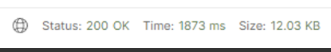
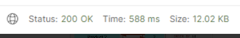

# 구현사항

- [구현사항](#구현사항)
  - [인기검색어](#인기-검색어)
  - [캐시 만료시간 설정](#캐시-만료시간-설정)
  - [페이징 성능 개선](#페이징-성능-개선)

## 인기 검색어

메인 페이지에 '인기 검색 캐릭터'를 보여주도록 구현했습니다.

Redis의 Sorted Set 자료구조를 이용해 구현했습니다.

동작 과정은 다음과 같습니다.

```
1. 캐릭터가 조회되었을 때, Redis의 Set에 해당 캐릭터가 조회되었음을 저장합니다.

2. 30분마다 Set에 있는 조회 내역을 취합하여 Sorted Set에 캐릭터의 조회수를 저장합니다.

3. 인기 검색 캐릭터 조회 요청이 왔을 때, Sorted Set의 Score가 높은 순으로 출력합니다.

4. 매일 00시마다 기간이 만료된 정보를 Set에서 삭제합니다.
```

---

캐릭터가 조회될 때마다 Redis의 Set에 캐릭터의 id를 Key로, (현재시각 + 7일)을 Value로 하여 저장합니다.

주간 인기 검색어로 하기 위해 7일을 더한 값으로 저장했습니다.

```java
@Override
public void addCharacterViewCount(String ocid) {
    SetOperations<String, String> setOperations = redisTemplate.opsForSet();
    String key = "characterViewCount::" + ocid;
    setOperations.add(key, LocalDateTime.now(ZoneId.of("Asia/Seoul")).plusDays(7).toString());
}
```

---

30분마다 캐릭터 조회 기록이 들어있는 Set의 size를 value로 하여 Sorted Set을 갱신하였습니다.

```java
@Scheduled(cron = "0 0/30 * * * ?")
public void addToZSetCharacterViewRank() {
    log.info("검색기록 zset에 삽입");
    Set<String> redisKeys = redisTemplate.keys("characterViewCount*");
    Objects.requireNonNull(redisKeys).forEach(
        data -> {
            String ocid = data.split("::")[1];
            Long size = redisTemplate.opsForSet().size(data);
            redisTemplate.opsForZSet().add("characterViewRank", ocid, size);
        }
    );
}
```

---

인기 검색어 조회 요청이 왔을 때, Sorted Set의 Score가 높은 순으로 5개를 출력하였습니다.

reverseRangeWithScores 메소드를 이용해 내림차순으로 출력했습니다.

```java
@Override
@RedisCacheable(value = "character-view-ranking")
public CharacterViewRankingResponseDto getPopularCharacters() {
    List<ViewRanking> rankings = new ArrayList<>();
    Set<ZSetOperations.TypedTuple<String>> ranking = redisTemplate.opsForZSet()
        .reverseRangeWithScores("characterViewRank", 0, 4);
    int rank = 1;
    for (ZSetOperations.TypedTuple<String> data : ranking) {
        String ocid = data.getValue();
        CharacterBasicDto characterBasicDto = characterApiService.getCharacterBasic(ocid);
        ViewRanking viewRanking = ViewRanking.of(rank++, characterBasicDto);
        rankings.add(viewRanking);
    }

    return CharacterViewRankingResponseDto.builder().ranking(rankings).build();
}
```

---

매일 00시에 기간이 만료된 정보들을 Set에서 제거하였습니다.

Set에 저장할 때 (현재 시각 + 7일)으로 저장하였기 때문에, Set의 Value값과 현재 날짜를 비교하여 만료된 데이터를 제거하였습니다.

```java
@Scheduled(cron = "0 0 0 * * *", zone = "Asia/Seoul")
public void removeFromsetCharacterViewRank() {
    log.info("기간 만료된 검색 기록 삭제");
    Set<String> redisKeys = redisTemplate.keys("characterViewCount*");
    Objects.requireNonNull(redisKeys).forEach(
        data -> {
            Set<String> redisExpireTime = redisTemplate.opsForSet().members(data);
            redisExpireTime.stream().forEach(expire -> {
                if(LocalDateTime.parse(expire).toLocalDate().isBefore(LocalDate.now(ZoneId.of("Asia/Seoul")))) {
                    redisTemplate.opsForSet().remove(data, expire);
                }
            });
        }
    );
}
```

---

## 캐시 만료시간 설정

Redis에 저장되는 캐시 데이터들의 만료시간을 설정하기 위해 AOP를 이용했습니다.

OpenAPI로 가져오는 데이터들이 매일 오전 1시에 갱신되는 특징이 있었기에 해당 시간에 맞춰 캐시를 만료시켜야 했습니다.

이를 위해 Configuration파일에 만료시간을 설정하였습니다.

```java
.entryTtl(
    Duration.between(
        LocalDateTime.now(zoneId),
        LocalDateTime.of(getNextDate(), ZonedDateTime.of(getNextDate(), LocalTime.of(1, 0, 0), zoneId).toLocalTime()))
)
```

RedisCacheConfiguration에 위와 같은 속성을 추가하여 설정하였는데 문제가 있었습니다.

Application이 실행될 때 해당 Configuration파일을 읽고, 그 시간으로부터 duration을 설정하여 의도와는 다르게 만료시간이 설정되었습니다.

예를 들어, Application이 오후 11시에 시작되면 다음날 오전 1시까지 남은 시간인 2시간을 ttl로 설정하여 이후에 저장되는 모든 캐시들의 만료시간이 2시간으로 적용되었습니다.

따라서, 캐시가 저장될 때마다 만료시간을 설정해 주기 위해 AOP를 이용하여 설정해주었습니다.

---

먼저, 사용할 어노테이션(@RedisCacheable)을 만들어주었습니다.

```java
@Target(ElementType.METHOD)
@Retention(RetentionPolicy.RUNTIME)
@Inherited
@Documented
public @interface RedisCacheable {

	String value() default "";
}
```

@RedisCacheable 어노테이션이 붙은 메소드들을 가져와 캐싱이 되게 했습니다.

@RedisCacheable에 value()값을 캐시에 저장될 Key값으로 합니다.

```java
@Aspect
@Component
@RequiredArgsConstructor
public class RedisCacheAspect {

	private final RedisTemplate redisTemplate;

	private CommonUtil commonUtil = new CommonUtil();

	@Around("@annotation(RedisCacheable)")
	public Object cacheableProcess(ProceedingJoinPoint joinPoint) throws Throwable {

		RedisCacheable redisCacheable = getCacheable(joinPoint);
		final String cacheKey = generateKey(redisCacheable.value(), joinPoint);

		// 같은 키로 캐시가 있으면 그 값 반환
		if (Boolean.TRUE.equals(redisTemplate.hasKey(cacheKey))) {
			return redisTemplate.opsForValue().get(cacheKey);
		}

		// 넣을 value 가져오기
		final Object methodReturnValue = joinPoint.proceed();

		// 만료시간 설정
		final long cacheTTL = commonUtil.setTtl();

		// value가 있을 때만 캐시에 저장한다
		if(methodReturnValue != null && String.valueOf(methodReturnValue).length() > 0) {
			if (cacheTTL < 0) {
				redisTemplate.opsForValue().set(cacheKey, methodReturnValue);
			} else {
				redisTemplate.opsForValue().set(cacheKey, methodReturnValue, cacheTTL, TimeUnit.SECONDS);
			}
		}

		return methodReturnValue;
	}

	private RedisCacheable getCacheable(ProceedingJoinPoint joinPoint) {
		final MethodSignature signature = (MethodSignature)joinPoint.getSignature();
		final Method method = signature.getMethod();

		return AnnotationUtils.getAnnotation(method, RedisCacheable.class);
	}

	private String generateKey(String cacheName, ProceedingJoinPoint joinPoint) {
		String generatedKey = StringUtils.arrayToDelimitedString(joinPoint.getArgs(), "_");

		return String.format("%s::%s", cacheName, generatedKey);
	}
}
```

@Around로 묶어서 @RedisCacheable이 붙은 메소드들에 대해 캐싱 로직을 적용합니다.

generateKey메소드를 통해 redis에 저장될 key로 변환합니다. '\_'를 '::'로 변환하여 저장했습니다.

같은 키로 저장된 캐시가 있다면 해당 값을 반환하였습니다.

같은 키로 저장된 캐시가 없다면 proceed된 값을 캐시에 저장할 value로 합니다.

메소드가 호출될 때마다 만료시간을 계산하여 각각 설정할 수 있도록 했습니다.

---

## 페이징 성능 개선

캐릭터들의 랭킹을 보여줄 페이징을 구현했습니다.

사용자가 많아져 db에 쌓이는 캐릭터 수가 많아져 페이징 속도가 느려졌고, 개선이 필요했습니다.

페이징 성능을 개선할 방법으로는 NoOffset 페이징, 커버링 인덱스를 사용하는 방법이 있었습니다.

NoOffset 페이징은 페이지 번호를 의미하는 offset을 쓰지 않고, 이전 페이지의 끝 부분을 기억하고 있다가 조회의 첫 부분을 찾을 때 사용하는 방법입니다.

다만, 진행중인 프로젝트 특성상 해당 방법을 사용할 수 없어서 커버링 인덱스를 사용하여 개선했습니다.

커버링 인덱스란 쿼리를 충족시키는 데 필요한 데이터를 갖고 있는 인덱스입니다. 이를 통해 출력할 데이터들의 id값을 조회한 후, 해당 id값이 담긴 List를 이용해 데이터를 조회하는 방식으로 구현했습니다.

커버링 인덱스를 구할 때 where, order by, offset, limit를 다 처리하여 id값만 빠르게 가져오고, 걸러진 데이터들에 대해 접근하기 때문에 성능 개선을 할 수 있었습니다.

```java
private List<CharacterCombatPowerRankingResponseDto> getCharacterCombatPowerRankingResponseDto(String worldName, String characterClass, Pageable pageable) {

    JPAQueryFactory query = querydslConfig.jpaQueryFactory();
    List<String> ocids = query
        .select(character.ocid)
        .from(character)
        .where(
            worldNameEq(worldName),
            characterClassEq(characterClass)
        )
        .orderBy(character.combat_power.desc())
        .offset(pageable.getOffset())
        .limit(pageable.getPageSize())
        .fetch();

    JPASQLQuery<?> query2 = new JPASQLQuery<>(em, sqlTemplates);
    List<CharacterCombatPowerRankingResponseDto> content = query2
        .select(Projections.constructor(CharacterCombatPowerRankingResponseDto.class,
            Expressions.asNumber(SQLExpressions.rank().over().orderBy(character.combat_power.desc())).add(pageable.getOffset()),
            character.world_name,
            character.character_name,
            character.combat_power,
            character.guild_name,
            character.character_class,
            character.character_level,
            character.character_image
            ))
        .from(character)
        .where(character.ocid.in(ocids))
        .fetch();

    return content;
}
```

커버링 인덱스로 대상의 id값을 가져와 ocids라는 리스트를 만들었고, 해당 리스트의 id값을 이용해 데이터에 접근하여 결과를 반환했습니다.

커버링 인덱스를 적용하기 전과 후의 속도 차이는 다음과 같습니다.

- Before

  </img>

- After

  </img>

커버링 인덱스를 적용하기 전과 비교해보니 3배 가까이 속도 개선이 된 것을 확인할 수 있었습니다.
